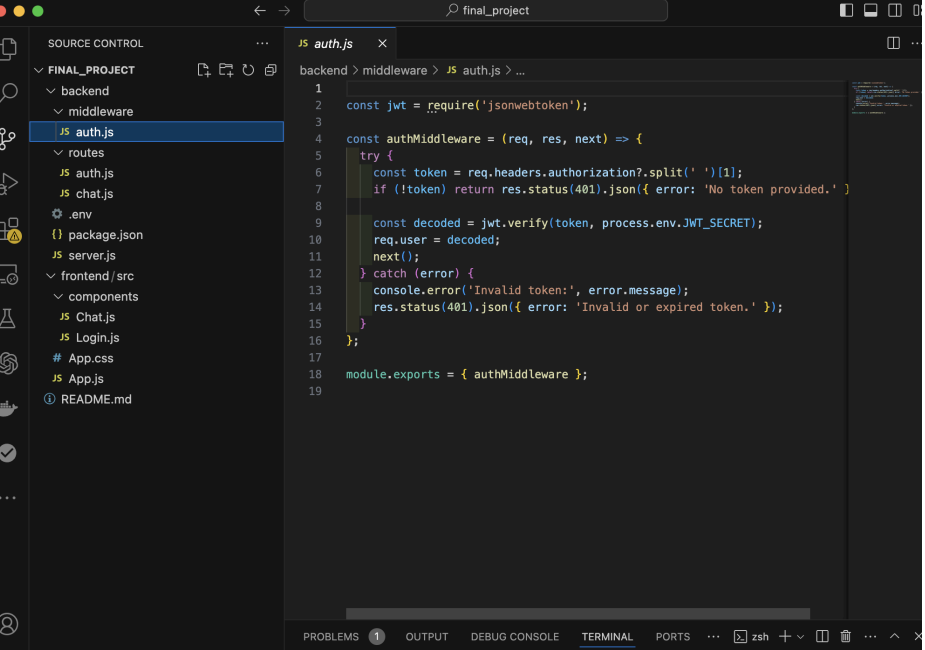
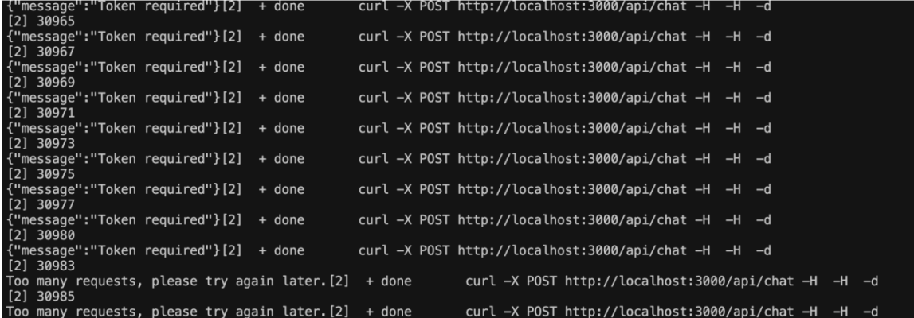
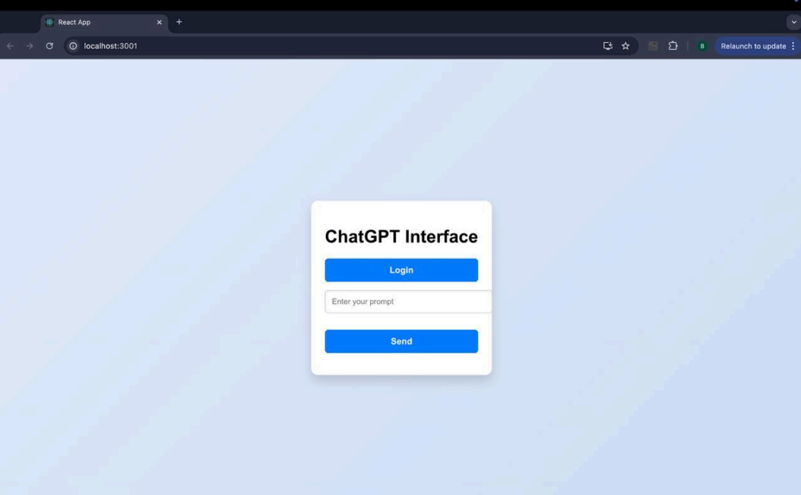
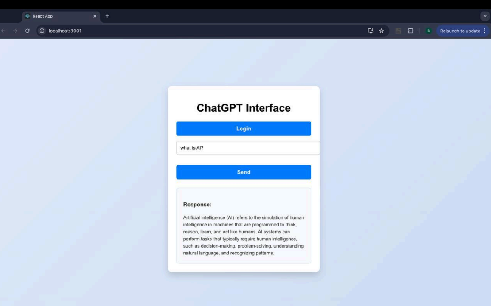

# Threat Model for LLM Chat GPT Model

## 1. Introduction

This project demonstrates the implementation of a secure chatbot application using OpenAI’s GPT-3.5 model. The application is built with Node.js and React, emphasizing security through the STRIDE threat modeling framework.

### Key Security Features Implemented:
- **JWT Authentication**: Prevents spoofing.
- **HTTPS and Input Validation**: Mitigates tampering.
- **Logging Mechanisms**: Addresses repudiation.
- **Secure Headers with Helmet**: Prevents information disclosure.
- **Rate Limiting**: Mitigates Denial of Service (DoS) attacks.
- **Role-Based Access Control (RBAC)**: Prevents privilege escalation.

---

## 2. System Architecture

The application comprises two main components:
1. **Backend (API Server)**: Built using Node.js with Express, responsible for user authentication, request handling, and communication with the OpenAI API.
2. **Frontend (React App)**: A responsive interface for users to interact with the backend securely.

### Backend Architecture Example:
```javascript
const express = require('express');
const cors = require('cors');
const helmet = require('helmet');
const rateLimit = require('express-rate-limit');
require('dotenv').config();
const authRoutes = require('./routes/auth');
const chatRoutes = require('./routes/chat');
const app = express();

// Security Middleware
app.use(helmet()); // Secure headers
app.use(cors({ origin: 'http://localhost:3000' })); // Allow frontend
app.use(express.json()); // Parse JSON bodies

// Rate Limiting
const limiter = rateLimit({
  windowMs: 15 * 60 * 1000,
  max: 100,
  message: { error: 'Too many requests. Try again later.' },
});
app.use(limiter);

// API Routes
app.use('/api/auth', authRoutes);
app.use('/api/chat', chatRoutes);

const PORT = process.env.PORT || 3000;
app.listen(PORT, () => console.log(`Server running on port ${PORT}`));




## 3. STRIDE Threat Model
### 3.1 Spoofing
**To prevent unauthorized access, JWT tokens are used for authentication. Only valid tokens
grant access to protected routes.**

```javascript
const jwt = require('jsonwebtoken');
const authMiddleware = (req, res, next) => {
const token = req.headers.authorization?.split(' ')[1];
if (!token) return res.status(401).json({ error: 'No token provided.' });
try {
const decoded = jwt.verify(token, process.env.JWT_SECRET);
req.user = decoded;
next();
} catch {
res.status(401).json({ error: 'Invalid or expired token.' });
}
};
module.exports = { authMiddleware };
**3.2 Tampering**
To secure data in transit and validate inputs, HTTPS is enforced, and all inputs are validated
on the server.

```javascript
router.post('/', authMiddleware, async (req, res) => {
const { prompt } = req.body;
if (!prompt || typeof prompt !== 'string') {
return res.status(400).json({ error: 'Invalid input' });
}
try {
const response = await openai.createCompletion({
model: 'text-davinci-003',
prompt,
max_tokens: 150,
});
res.json({ response: response.data.choices[0].text });
} catch (error) {
res.status(500).json({ error: 'Failed to process your request.' });
}
});

```

**3.3 Repudiation**
Logging mechanisms ensure that user actions are recorded, preventing denial of performed
actions.

```Javascript
const morgan = require('morgan');
// Logging Middleware
app.use(morgan('combined'));
// Error Handling
app.use((err, req, res, next) => {
console.error(err.stack);
res.status(500).send({ error: 'An internal error occurred.' });
});
3.4 Information Disclosure
Helmet is used to secure HTTP headers and prevent sensitive information leaks.
const helmet = require('helmet');
app.use(
helmet({
contentSecurityPolicy: {
directives: {
defaultSrc: ["'self'"],
scriptSrc: ["'self'", "'unsafe-inline'"],
},
},
referrerPolicy: { policy: 'no-referrer' },
frameguard: { action: 'deny' },
hsts: {
maxAge: 31536000,
includeSubDomains: true,
preload: true,
},
noSniff: true,
})
);

```

**3.5 Denial of Service (DoS)**
Rate limiting restricts the number of requests from a single client, mitigating DoS attacks.

```
const rateLimit = require('express-rate-limit');
const limiter = rateLimit({
windowMs: 15 * 60 * 1000,
max: 100,
message: { error: 'Too many requests. Try again later.' },
});
app.use(limiter);
```



**3.6 Elevation of Privilege**
Role-based access control ensures users cannot perform unauthorized actions.
```
router.post('/admin', authMiddleware, (req, res) => {
if (req.user.role !== 'admin') {
return res.status(403).json({ error: 'Access denied' });
}
res.send('Admin content');
});
```





**4. Conclusion**
The application adheres to STRIDE principles, ensuring secure interaction with OpenAI’s
GPT-3.5 model. Implementing JWT authentication, rate limiting, Helmet headers, and
logging mechanisms safeguards the system against spoofing, tampering, and other common
threats.